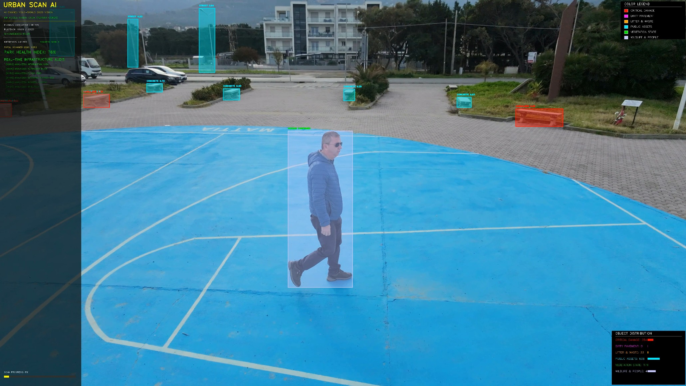
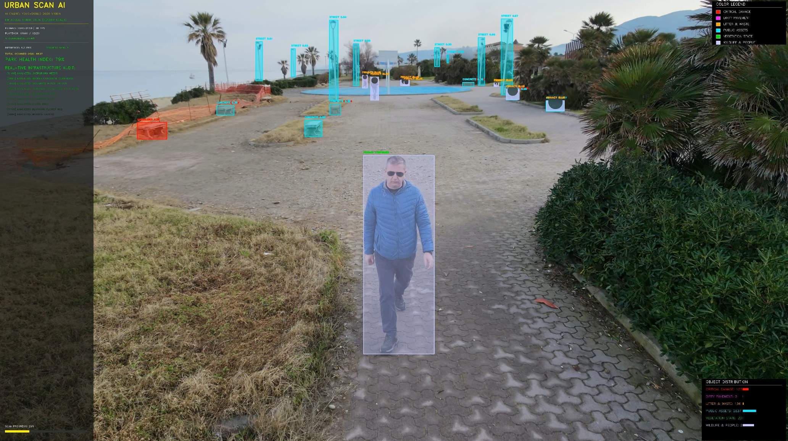
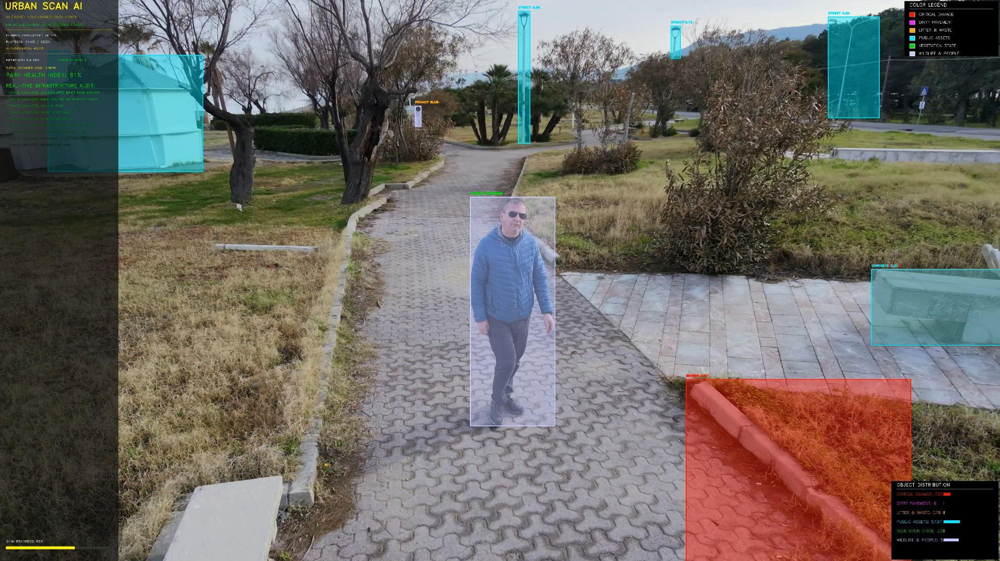

# 🌿 Video UrbanScan AI - Next Gen (2026 Vision)

<div align="center">
  
  
  
  
  
</div>

<div align="center">
  <h3>Advanced, Open-Vocabulary Video Analytics engine for Urban Parks and Infrastructure Diagnostics.</h3>
  <br>
  <a href="https://fidacaro.com"><strong>🌐 Discover more on fidacaro.com</strong></a>
</div>

---

<div align="center">
  <video width="100%" controls>
    <source src="output_2026_vision_final.mp4" type="video/mp4">
    Your browser does not support the video tag.
  </video>
  <p><i>Input video footage originally captured with a <b>DJI Neo 2</b> drone.</i></p>
</div>

## 📸 Real-time Scan Previews

Here are some snapshots directly extracted from our Open-Vocabulary AI processing the urban environment:

<p align="center">
  
  
  
</p>

## 🚀 Overview
**UrbanScan AI** is an incredibly powerful diagnostic tool that acts as a real-time scanner for urban environments, particularly public parks, gardens, and pathways. Built upon the latest **YOLOv26 World-v2 Architecture**, this application bridges the gap between raw object detection and complex environmental analysis. 

Instead of generating basic square tracking boxes, UrbanScan uses *Instance Segmentation Overlays* and real-time computation to map, identify, and categorize hundreds of items.

## 🌟 Key Features
* 🔍 **Unprecedented Open-Vocabulary Scanning:** Identifies up to 40 intricate sub-categories, from `abandoned shopping carts` to `collapsed brick walls`, all the way to `colorful butterflies`.
* 🖥️ **Adaptive Hardware Engine:** Built from the ground up to scale its processing power based on your host machine:
  * **Nvidia CUDA Mode:** Exploits native Tensor Cores running FP16 Multi-Scale tests across raw 1920x1080 frames for ultra-high GPU utilization.
  * **Intel OpenVINO Mode:** Automatically detects CPU or ARC architectures, switching paths and requiring a pre-exported OpenVINO model for lightning-fast execution without burning out lightweight system resources.
* 🛡️ **Built-in Auto-Privacy System:** When processing people, the algorithm finds the largest "Host" and perfectly tracks them. Any bystanders in the background automatically receive an aggressive real-time `Gaussian Blur` around their facial coordinates. No more post-processing tracking needed!
* 📊 **Professional Analytics HUD:** Features a complete, transparent on-screen overlay monitoring:
  * Overall **Park Health Index** (calculated via positive vs negative infrastructure occurrences).
  * Video Playback progression and rendering times.
  * Average AI Confidence Rating across the entire real-time frame.
  * Continuous Infrastructure Analysis Live Logging.

## ⚙️ Installation & Prerequisites
You need a system with Python 3.9+ running.

```bash
# Clone the repository
git clone https://github.com/salvino72/video-urbanscan.git
cd video-urbanscan

# Install the dependencies
pip install ultralytics opencv-python numpy
```

## 🎮 How to use the engine

The application has been explicitly designed to easily **switch between GPU/CPU backends**, granting extreme accessibility depending on the hardware you have.

**1. NVIDIA CUDA Processing (Default)**
For extreme precision and deep learning hardware utilization:
```bash
python analyze_video.py --input path/to/your/video.mp4 --output scan_result.mp4 --device 0
```

**2. INTEL CPU / ARC GPU (OpenVINO Mode)**
For efficient, scalable execution on CPU or Intel Arc architectures, you MUST first export the required model from PyTorch to OpenVINO syntax. 
*The script has full fallback handling and custom UI colors mapped specifically for Intel rendering instances.*
```bash
# 1. Export the model
yolo export model=yolov26-worldv2.pt format=openvino

# 2. Run the application requesting CPU architecture
python analyze_video.py --input path/to/your/video.mp4 --output scan_result.mp4 --device cpu
```

## 📑 Understanding the Dashboard Categories
UrbanScan separates findings into distinct color-coded data sets on screen:

🟩 **Green (Nature/Animals):** `mature tree canopy`, `blooming flower bed`, `dog walking`
🟨 **Cyan (Public Assets):** `concrete park bench`, `information sign`, `drinking fountain`
🟧 **Orange (Pollution/Litter):** `plastic bottle trash`, `rusty can`, `glass shards`
🟪 **Fuchsia (Pavement Conditions):** `mud puddle on path`, `loose sand accumulation`
🟥 **Red (Severe Damage):** `deep pavement pothole`, `collapsed brick wall`
<br><br>

## 📜 License & Attribution (CC BY 4.0 / MIT)
This project is released under an open-source license that strictly **requires attribution**. 
You are free to use, share, and adapt the software and concept, provided you must give appropriate credit to the author, provide a link to the license, and indicate if changes were made.
For full details, please refer to the [Creative Commons Attribution 4.0 International](https://creativecommons.org/licenses/by/4.0/) standard.

*Concept and architecture developed by the author. Find more projects at **[fidacaro.com](https://fidacaro.com)***.
